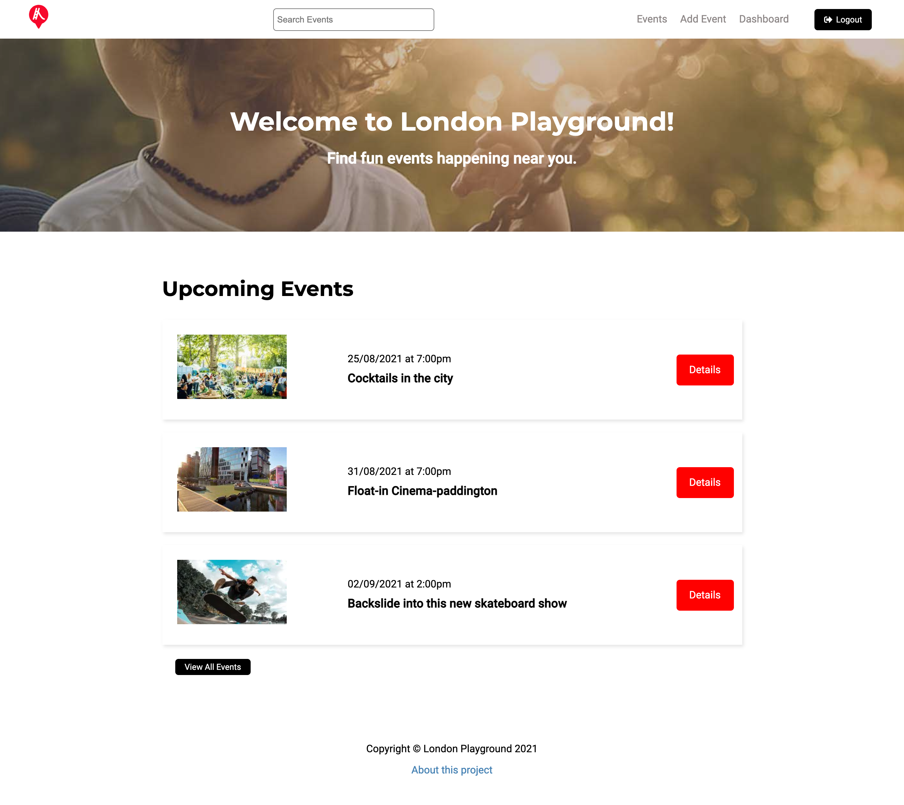

# London Playground

Event searching & posting app built with Nextjs.

This site uses Strapi as a backend.

## Overview

### Screenshot

### Links

- Live Site URL: [https://londonplaygroundfrontend.vercel.app/](https://londonplaygroundfrontend.vercel.app/)

## My process

### Built with

- [React](https://reactjs.org/) - JS library
- [Next.js](https://nextjs.org/) - React framework
- [Vercel](https://vercel.com/) - Next.js deploy
- [Strapi](https://strapi.io/) - backend CMS
- [Cloudinary](https://cloudinary.com/) - media management
- [Heroku](https://www.heroku.com/) - backend deploy
- [Mapbox](https://www.mapbox.com/) - geocoding
- [React-Toastify](https://www.npmjs.com/package/react-toastify) - notifications

### Useful resources

## Acknowledgments
